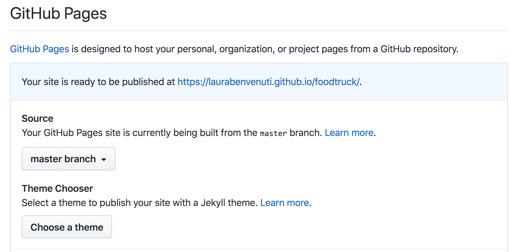

# foodtruck
eindopdracht FED1

## publiceren:
maak een repository, zet de code online, publiceer via 

## settings: 
gitHub pages, kies source. Ik heb gekozen voor masterBranch. Zorg dat je landingspagina **index.html** heet. Het duurt even want de pages moeten worden angemaakt, maar daarna vind je de url van je site via de settings:

